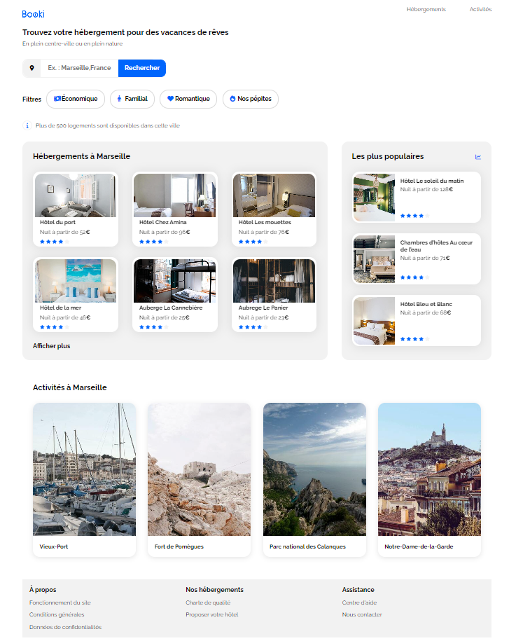

# Projet 2 : Créez la page d'accueil d'une agence de voyage avec HTML & CSS

# 
Booki

 

# 
 Informations

Développement d'une application web nommée "Booki" dans laquelle les utilisateurs pourront trouver des hébergements et des activités dans la ville de leur choix. Le but est de créer le frontend de l'application, avec HTML et CSS. Et rendre les pages agréables pour les utilisateurs que ce soit sur ordinateur, tablette ou téléphone.

# 
 Compétences

Implémenter une interface responsive avec HTML et CSS

Intégrer du contenu conformément à une maquette avec HTML et CSS

Versionner son projet avec Git et Github

Installer un environnement de développement front-end

# 
 Difficultés

Gérer le contenu en mesure de pourcentage et non fixe

Pour les tablettes d'ecran 768px, changement des font size des card pour que les card soit ergonomiquement de même taille

    
